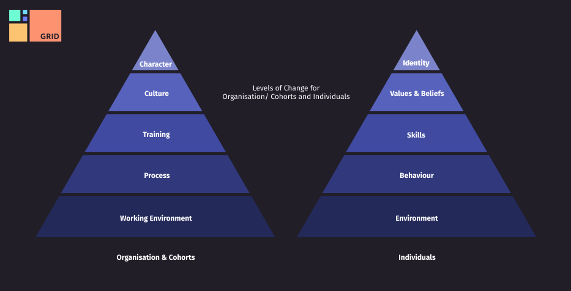

# {{ page.title }}

{{ page.project }} Conceptual Levels for Change is a model for making significant organisational structural changes. Unlike [Prosci ADKAR](https://www.prosci.com/methodology/adkar), [Kotter's 8 step method ](https://www.kotterinc.com/methodology/8-steps/) or similar change facilitation models, which you can use with {{ page.project }}, this model highlights which organisation conceptual layer is best targeted for significant change.

Each layer of this model would have a higher ROI. For example, simply changing a process without updating skills will cause problems, however if one updates the skills first then it is more likely to have an effect on the process.

