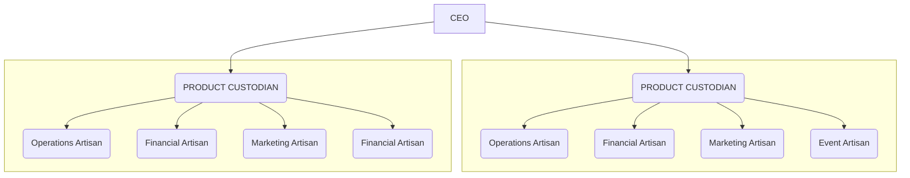
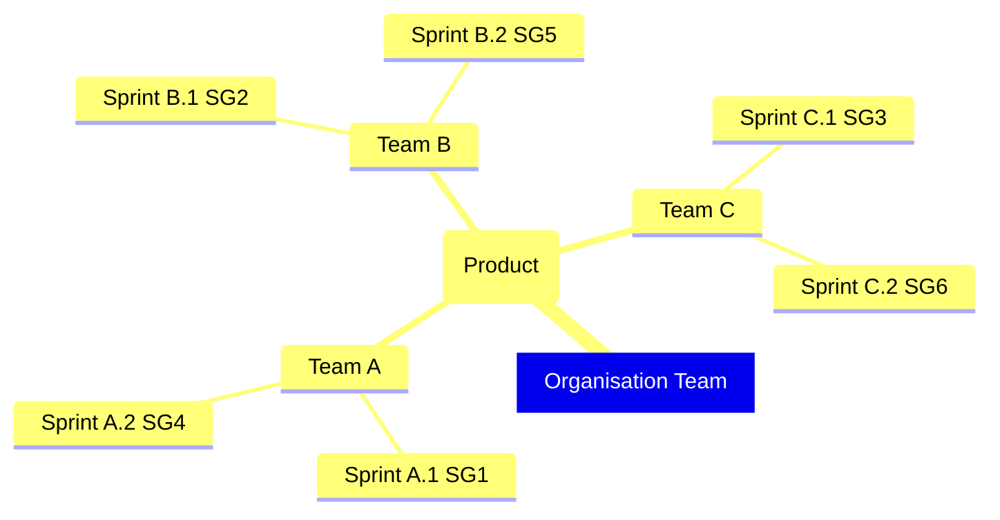

## {{ page.title }}

```mermaid
flowchart TD
    CEO --> PC1(PRODUCT CUSTODIAN)
    CEO --> PC2(PRODUCT CUSTODIAN)
    subgraph  
    PC1 --> OA(Operations Artisan)
    PC1 --> FC(Financial Artisan)
    PC1 --> MC(Marketing Artisan)
    PC1 --> PC(Event Artisan)
    end
    subgraph  
    PC2 --> POC(Operations Artisan)
    PC2 --> PAC(Financial Artisan)
    PC2 --> PM(Marketing Artisan)
    PC2 --> PF(Financial Artisan)
    end
```

```mermaid
mindmap
  root[Organisation Team]
    (Product)
      Team A
        Sprint A.1 SG1
        Sprint A.2 SG4
      Team B
        Sprint B.1 SG2
        Sprint B.2 SG5
      Team C
        Sprint C.1 SG3
        Sprint C.2 SG6
```
